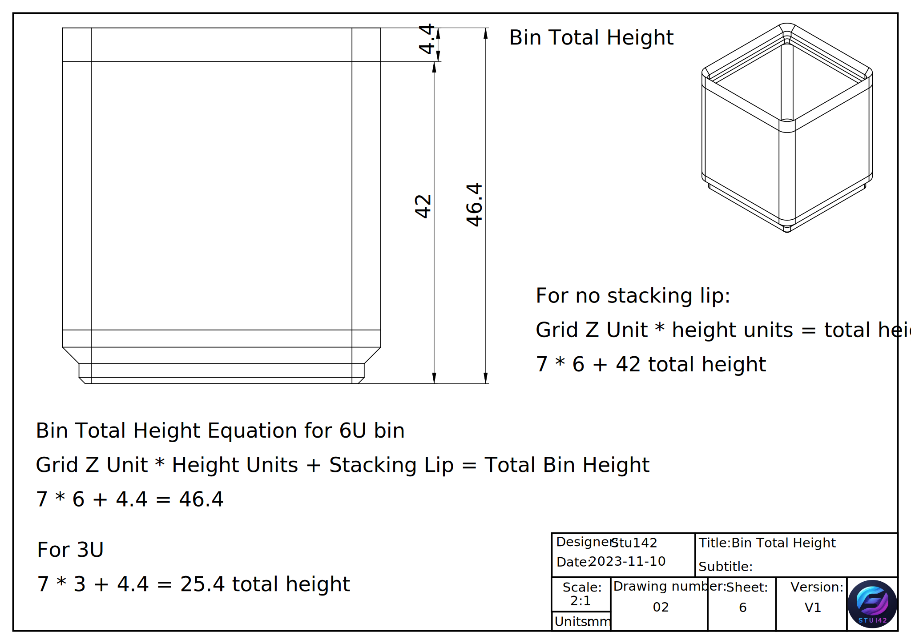

# Gridfinity-Documentation
Documentation relating to the Gridfinity project by Zack Freedman to provide designers with the information to make cool things. If you are new to gridfinity watch [Zack's intro video](https://www.youtube.com/watch?v=ra_9zU-mnl8).

You can also check out the [Gridfinity website](https://gridfinity.xyz/).

Please let me know if you find errors or have suggestions on how to make the information easier to understand. I want to make this the untimate Gridfinity resourse. 

# Overview 
This page will include technical drawings to explain Gridfinity and make it easier for everyone to design components that conform to the standards and ensure compatibility. There are many drawings here and it is not the most efficient way to create an engineering drawing, but it is meant to provide the most amount of information from different perspectives to make sure the most amount of people can understand it and don't need to do calculations for dimensions. 

**If you find this free page valuable your support is appreciated: [https://stu142.com/supportme](https://stu142.com/supportme). Thanks for allowing me to share more with this wonderful community.** 

All of the models and drawings displayed on this page were made using [FreeCAD](https://www.freecad.org/).

Check out my [FreeCAD Gridfinity Generator](https://github.com/Stu142/FreeCAD-Gridfinity-Workbench) which is a workbench that can be installed from the built-in addon manager and can generate an assortment of bins and baseplates with the click of a button. 

My parametric FreeCAD files can be found in my [printables collection](https://www.printables.com/@Stu142_524934/collections/969910).

Product links on the page may be affiliate links. 

# Original Spec
Alright, let's get into it. This section will include the specifications of Zach's original models for baseplates and bins. 

## Baseplate

## Bins/Containers
This section contains information about bin design 

### Bin Base Profile

The following image will show the corner radius dimenions of the bin as well as magnet holes and screw holes that are optional. [6 mm x 2 mm magnets](https://geni.us/X9t1M) (Amazon) are the standard size in the gridfinity ecosystem. [M3 Screws]() (Amazon) are also commonly used and the bin can be secured by screwing up from the bottom. 

The Screw holes can also be widened to a diameter of 4.2 mm to allow for [M3 heat set inserts](https://geni.us/Svm0Sl) (Amazon) to be used as a more secure methode of attachement. 

### Bin Units explanation

### Bin Stacking lip
This section includes the profile of the stacking lip. There are two options and both work fine. 

The rounded Staking lip is not the exact same as the one in Zach's original models, but it is close and easier to recreate. What you do at the tip of the stacking lip doesn't really matter as long as everything else is the same. 

# Assembly drawings 
Coming soon

Aiming to show how the tolerances between bins work. 

# Extras
coming soon

will include information about magnet holes and sequential bridging 

# Where to buy Components 
This section includes affiliate links for components and materials to create your ultimate Gridfinity set up. 

Filament:

[Polymaker PETG](https://geni.us/CBTpq) (Amazon).

[Polymaker PLA](https://geni.us/qoaqfE) (Amazon).

Begginner 3D printer [Sovol SV06 plus](https://geni.us/fWW26p) (Amazon).

Hardware:

[M3 Screw set](https://geni.us/gfP7w) (Amazon).

[M3 heat set insert](https://geni.us/Svm0Sl) (Amazon).

[6 mm x 2 mm magnets](https://geni.us/X9t1M) (Amazon).

