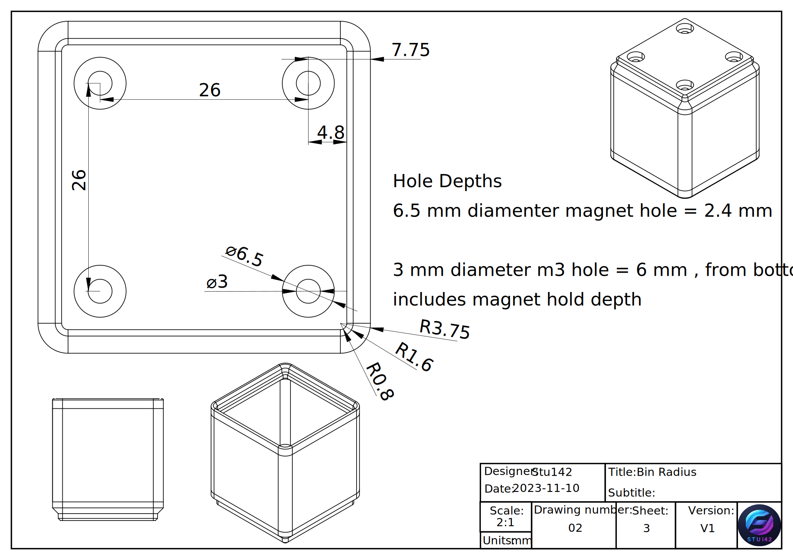

# Gridfinity-Documentation
Documentation relating to the Gridfinity project by Zach Freedman to provide designers with the information to make cool things
Description

Gridfinity is a modular storage system designed by Zach Freedman and a video explaination can be found here: 

the Gridfinity site can be found here:

This page will inculde techinical drawings to explain gridfinity and make it easier for people to design components that conform to the standards and ensure compatibility. As well as introducing GridfinitySS which is a slight modification to the orifinal spec that is completely compatable but optimized for a 0.2 mm layer height and 0.4 mm nozzle the most standard size. 

# Overview 
There are many drawings here and it is not the most efficient way to create an engineering drawing but it is meant to provide the most amount of information and from different perspectives to make sure the most amount of people can understand it. 

# Original Spec

## Baseplate

## bin
This section contains information about bin design 

### Bin Units explanation

### Bin base 

### Bin Stacking lip

# Gridfinity SS

[GridfinityBaseplate-Section View.pdf](https://github.com/Stu142/Gridfinity-Documentation/files/13200376/GridfinityBaseplate-Section.View.pdf)

This section is contains the spec to a optimized version of gridfinity that is completely compattable with the old spec but optimezed for the standard printing nozzle size. 

