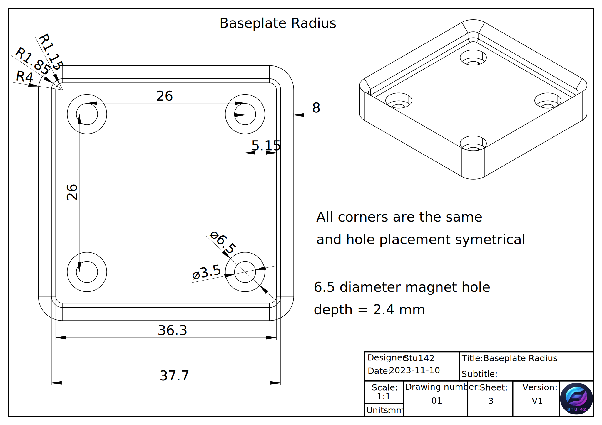

# Gridfinity-Documentation
Documentation relating to the Gridfinity project by Zach Freedman to provide designers with the information to make cool things. If you are new to gridfinity watch [Zach's intro video](https://www.youtube.com/watch?v=ra_9zU-mnl8).

You can also check out the [Gridfinity website](https://gridfinity.xyz/).

# Overview 
This page will inculde techinical drawings to explain gridfinity and make it easier for everyone to design components that conform to the standards and ensure compatibility. There are many drawings here and it is not the most efficient way to create an engineering drawing but it is meant to provide the most amount of information and from different perspectives to make sure the most amount of people can understand it and don't need to do calculations for dimensions. 

My parametric FreeCAD files can be found in my [printables collection](https://www.printables.com/@Stu142_524934/collections/969910).

If you find this free page valuable support is appreciated: [Paypal](http://paypal.me/Stu142). I really appreciate it. 

All of the models and drawings displayed on this page were made using [FreeCAD](https://www.freecad.org/).

Product links on the page may be affiliate links. 

# Original Spec
Alright lets get into it. This section will include the specifications of Zach's original models for baseplates and bins. 

## Baseplate

## Bins/Containers
This section contains information about bin design 

### Bin Units explanation

### Bin base 

### Bin Stacking lip
This section includes the profile of the stacking lip. There are two option and both work fine. 

For the rounded Staking lip it is not hte exact same as the one is Zach's original models but close and easier to recreate. What you do at the top doesn't really matter as long as everything else is the same. 

# Assbmly drawings 
Coming soon

aiming to show how the tolerances work. 

# Extras
coming soon

includes information about magnet holes and sequential bridging 
